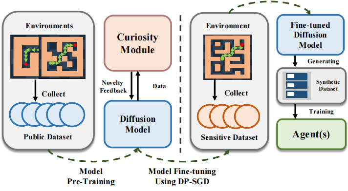

<div align=center>
  
# PrivORL: Differentially Private Synthetic Dataset for Offline Reinforcement Learning
</div>

This is the official implementaion of paper ***PrivORL: Differentially Private Synthetic Dataset for Offline Reinforcement Learning***. This repository contains Pytorch training code and evaluation code. PrivORL leverages a diffusion model and diffusion transformer to synthesize *transitions and trajectories*, respectively, under DP. The synthetic dataset can then be securely released for downstream analysis and research. PrivORL adopts the popular approach of pre-training a synthesizer on public datasets, and then fine-tuning on sensitive datasets using DP Stochastic Gradient Descent (DP-SGD).
Additionally, PrivORL introduces curiosity-driven pre-training, which uses feedback from the curiosity module to diversify the synthetic dataset and thus can generate diverse synthetic transitions and trajectories that closely resemble the sensitive dataset.

<div align=center>

</div>

<p align="center">The workflow of PrivCode.</p>

## 1. Contents
PrivORL: Differentially Private Synthetic Dataset for Offline Reinforcement Learning

  - [1. Contents](#1-contents)
  - [2. Project structure](#2-project-structure)
  - [3. Get Start](#3-get-start)
    - [3.1 Installation](#31-installation)
    - [3.2 Dataset](#32-dataset)
  - [4. Running Instructions](#running-instructions)
  - [5. Acknowledgment](#5-acknowledgment)


## 2. Project structure

> **Note:** I should clean the structure after editing.


The structure of this project is as follows:
```
MuJoCo
    -- bash-agent-training.py ------------ the script for downstream tasks (training the agents using the real or synthetic transitions)
    -- bash-baselines-agent-training.py -- the script for downstream task for the baselines (training the agents using the real or synthetic transitions)
    -- bash-evaluate-marginal.py --------- the script for computing the marginal
    -- bash-train-diffusion.py ----------- the script for pre-training and fine-tuning of diffusion models
    -- awac.py --------------------------- training agent using awac algorithm
    -- iql.py ---------------------------- training agent using iql algorithm
    -- iql.py ---------------------------- training agent using iql algorithm
    -- td3_bc.py ------------------------- training agent using td3_bc algorithm
    -- train_diffuser.py ----------------- pre-training and fine-tuning of diffusion models
    -- marginal.py ----------------------- computing marginal between synthetic and real transitions
    -- mia.py ---------------------------- mia for the diffusion models
    -- synther
      -- corl ---------------------------- configuration files of downstream tasks
      -- diffuser ------------------------ utilities and scripts of diffusion model
    -- t-SNE ----------------------------- t-SNE visualization
    -- config ---------------------------- gin configuration files of PrivTranR training and synthetizing
Baselines
    -- datasets
      -- maze2d-umaze-dense-v1
      -- ...
      -- walker2d-medium-repaly-v2 ------- csv and json files of your own datasets
      -- bash-data-generate.py ----------- the script for loading d4rl datasets and saving csv and json
      -- data-generate.py ---------------- loading d4rl datasets and saving csv and json
    -- exp ------------------------------- model weights and synthetic transitions
    -- samples --------------------------- npz files of synthetic transitions for downstream tasks      
    -- scripts
      -- bash-data-process.py ------------ the script for splitting datasets
      -- bash-train-baselines.py --------- the script for training and synthetizing of baselines
      -- bash-completion.py -------------- the script for completing the missing dimensions of synthetic transitions
      -- data_process.py ----------------- splitting datasets
      -- syn_synthesizer.py -------------- training and synthetizing of baselines
      -- completion.py ------------------- completing the missing dimensions of synthetic transitions
    -- synthesizer
      -- pgm.py -------------------------- training pgm and synthetizing transitions
      -- privsyn.py ---------------------- training privsyn and synthetizing transitions
      -- pategan.py ---------------------- training pategan and synthetizing transitions
      -- pretraining_pategan.py ---------- training pretraining_pategan and synthetizing transitions
```

## 3. Get Start

### 3.1 Installation

To install, clone the repository and run the following:

```bash 
git submodule update --init --recursive
pip install -r requirements.txt
```

For baseline, we refer to the public repository in [SynMeter](https://github.com/zealscott/SynMeter)

The code was tested on Python 3.9.18.
If you don't have MuJoCo installed, follow the instructions here: https://github.com/openai/mujoco-py#install-mujoco.

### 3.2 Dataset

We use the dataset released from [D4RL](https://github.com/Farama-Foundation/D4RL). Our code will automatically download and preprocess the dataset. We list the supported sensitive dataset as follows,


| Domain         | Sensitive Dataset        |
|---------------|---------------------------|
| Maze2D        | maze2d-umaze-dense-v1            |
| Maze2D        | maze2d-medium-dense-v1           |
| Maze2D        | maze2d-large-dense-v1            |
| FrankaKitchen | kitchen-partial-v0         |
| MuJoCo        | halfcheetah-medium-replay-v2    |


## 4. Running Instructions

This paper includes PrivORL-n and PrivORL-j for DP offline RL transition and trajectory synthesis. We elaborate on them as follows.

### 4.1 PrviORL-n

We list the key hyper-parameters below, including their explanations,

- `dp_epsilon`: controls the privacy budget. The default value is 10.0.
- `datasets`: the sensitive datasets.
- `datasets_name`: the pretranining datasets.
- `seed`: the value of random seed.
- `curiosity_driven_rate`: the value of curiosity driven rate in the pretraining phase.
- `accountant`: the privacy budget accounting methods, the option is [`prv`, `rdp`]; the default option is [`rdp`].
- `results_folder`: the path of saved model configs, checkpoints, and synthetic trajectory.
- `save_file_name`: the name of saved synthetic trajectory under `results_folder` folder.
- `load_path`: the path of the saved pretraining model checkpoint for further fine-tuning.
- `load_checkpoint`: the action config, add to choose DP fine-tuning, otherwise Non-DP pretraining.


#### Step1: Curiosity-driven Pre-training

Diffusion model pre-training:

```
python synther/training/train_diffuser.py --dataset <the-name-of-dataset> --datasets_name <the-pretraining-dataset> --curiosity_driven --curiosity_driven_rate 0.3 --results_folder <the-target-folder>  --save_file_name <store_path> 
```

For example, when we set `maze2d-medium-dense-v1` as the sensitive dataset and [`maze2d-open-dense-v0`, `maze2d-umaze-dense-v1`, `maze2d-large-dense-v1`] as the pretraining datasets,
```
python synther/training/train_diffuser.py --dataset maze2d-medium-dense-v1 --datasets_name "['maze2d-open-dense-v0', 'maze2d-umaze-dense-v1', 'maze2d-large-dense-v1']" --curiosity_driven --curiosity_driven_rate 0.3 --results_folder ./results_maze2d-medium-dense-v1_0.3 --save_file_name maze2d-medium-dense-v1_samples_1000000.0_10dp_0.8.npz
```

After training, we can find the result in the folder ```./results_maze2d-medium-dense-v1_0.3```, including the checkpoint ```pretraining-model-9.pt```.


> [!Note]
>
> We provide .


#### Step2: Fine-tuning on Sensitive Datasets

Fine-tuning the pre-trained diffusion models (this automatically generates samples and saves them):

```
python synther/training/train_diffuser.py --dataset <the-name-of-dataset> --dp_epsilon 10 --results_folder <the-target-folder> --save_file_name <store_path> --load_path <the-path-of-saved-pretraining-model> --load_checkpoint
```
The ```load_checkpoint``` config is a action config, add to command for choosing DP fine-tuning, otherwise for Non-DP pretraining.

For example, 
```
python synther/training/train_diffuser.py --dataset maze2d-medium-dense-v1 --dp_epsilon 10 --results_folder ./results_maze2d-medium-dense-v1_0.3_rdp --load_path ./results_maze2d-medium-dense-v1_0.3_rdp/pretraining-model-4.pt --save_file_name maze2d-medium-dense-v1_samples_1000000.0_10dp_0.8_rdp.npz --load_checkpoint
```

After training, we can find the result in the folder ```./results_maze2d-medium-dense-v1_0.3```, including the checkpoint ```finetuning_dp10.0-model-4.pt```, and the synthetic trajectories ```maze2d-medium-dense-v1_samples_1000000.0_10dp_0.5.npz```.

#### Step3: Downstream Tasks Agent Training (Utility, Results in Table I)

The offline RL algorithm option is [`iql`, `edac`, `td3plusbc`].

Training agents using the synthetic transitions of PrivORL-n:

```
python evaluation/eval-agent/iql.py --env <the-name-of-synthetic-transitions> --checkpoints_path <store_path> --config <the-path-of-configuration-file> --dp_epsilon <the-privacy-budget-of-synthetic-transitions> --diffusion.path <the-path-of-saved-transitions> --name <the-name-of-logging> --prefix <the-prefix-of-name> --save_checkpoints <whether-to-save-ckpt>
```

For example, 

```
python evaluation/eval-agent/iql.py --env maze2d-medium-dense-v1 --checkpoints_path corl_logs_param_analysis_v1_maze2d_pretrain/ --config synther/corl/yaml/iql/maze2d/medium-dense-v1.yaml --dp_epsilon 10 --diffusion.path ./results_maze2d-medium-dense-v1_0.3_rdp/cleaned_pretrain_samples.npz --name CurDPsynthER --prefix 0.3CurRate --save_checkpoints False
```

After training, we can find the result in the folder ```./corl_logs_param_analysis_v1_maze2d_prv/0.3CurRate_CurDPsynthER-iql-maze2d-medium-dense-v1-epsilon_10-seed_0-202509260435```, including the evaluation result ```eval_0.json```.

#### Step4: Marginal and Correlation Computing (Fidelity, Results in Table III)

Compute the marginal and correlation values between the synthetic and real transitions:

```
python evaluation/eval-fidelity/marginal.py --dataset <the-name-of-synthetic-transitions> --dp_epsilon <the-privacy-budget-of-synthetic-transitions> --cur_rate <the-curiosity-rate-of-synthetic-transitions> --load_path <the-path-of-saved-transitions>
```

For example, 

```
python evaluation/eval-fidelity/marginal.py --dataset maze2d-medium-dense-v1 --dp_epsilon 10 --load_path alter_0.3curiosity_driven_results_maze2d-medium-dense-v1_1.0/cleaned_maze2d-medium-dense-v1_samples_1000000.0_10dp_0.8.npz --cur_rate 0.3
```

#### Step5: MIA (Privacy Evaluations, Results in Table XII)

Change the args nondp_weight, dp1_weight and dp10_weight to the corresponding checkpoints and run:

```
python evaluation/eval-mia/mia.py
```

### 4.2 PrviORL-j

#### Step1: Curiosity-driven Pre-training

Diffusion model pre-training:

```
python scripts/mtdiff_s.py --dataset <the-name-of-dataset> --finetune "False" --curiosity_rate <the-curiosity-rate-of-synthetic-trajectories> --horizon <the-number-of-parallel-trajectories> --model models.TasksAug --diffusion models.AugDiffusion --loss_type statehuber --loader datasets.AugDataset --logbase <the-path-of-saving-checkpoints> 
```

For example, 

```
python scripts/mtdiff_s.py --dataset "maze2d-large-dense-v1" --finetune "False" --curiosity_rate "0.3" --horizon "32" --model models.TasksAug --diffusion models.AugDiffusion --loss_type statehuber --loader datasets.AugDataset --logbase 'logs'
```

#### Step2: Fine-tuning on Sensitive Datasets

Fine-tuning the pre-trained diffusion models:

```
python scripts/mtdiff_s.py --dataset <the-name-of-dataset> --finetune "True" --curiosity_rate <the-curiosity-rate-of-synthetic-trajectories> --horizon <the-number-of-parallel-trajectories> --checkpoint_path <the-path-of-pretraining-model-checkpoint> --target_epsilon <the-privacy-budget-of-synthetic-trajectories> --model models.TasksAug --diffusion models.AugDiffusion --loss_type statehuber --loader datasets.AugDataset --logbase <the-path-of-saving-checkpoints> 
```

For example, 

```
python scripts/mtdiff_s.py --dataset "maze2d-large-dense-v1" --finetune "True" --curiosity_rate <the-curiosity-rate-of-synthetic-trajectories> --horizon <the-number-of-parallel-trajectories> --checkpoint_path "logs/maze2d-large-dense-v1/pretrain/horizon32_curiosity0.3/state_500000.pt" --target_epsilon "10" --model models.TasksAug --diffusion models.AugDiffusion --loss_type statehuber --loader datasets.AugDataset --logbase 'logs'
```

#### Step3: Sampling Synthetic Trajectories

Sampling synthetic trajectories using the fine-tuned checkpoint:

```
python scripts/sample.py --dataset <the-name-of-dataset> --finetune "True" --target_epsilon <the-privacy-budget-of-synthetic-trajectories> --sample_checkpoint_path <the-path-of-saving-checkpoints> --output_csv_path <the-path-of-saving-synthetic-trajectories>  --model models.TasksAug --diffusion models.AugDiffusion --loss_type statehuber --loader datasets.AugDataset
```

For example, 
```
python scripts/sample.py --dataset "maze2d-medium-dense-v1" --finetune "True" --target_epsilon "1" --sample_checkpoint_path "logs/maze2d-medium-dense-v1/finetune/epsilon1_horizon32_curiosity0.3/state_final.pt" --output_csv_path "results/maze2d-medium-dense-v1/finetune/epsilon1_horizon32_curiosity0.3/state_final/sampled_trajectories.csv" --model models.TasksAug --diffusion models.AugDiffusion --loss_type statehuber --loader datasets.AugDataset
```

### 4.3 Abalation

#### NonCurPrivTranR:

Diffusion model pre-training:

Pre-train the diffusion model without curosity-driven method:

```
python synther/training/train_diffuser.py --dataset <the-name-of-dataset> --datasets_name <the-pretraining-dataset> --results_folder <the-target-folder>  --save_file_name <store_path> 
```

For example, 

```
python synther/training/train_diffuser.py --dataset maze2d-medium-dense-v1 --datasets_name "['maze2d-open-dense-v0', 'maze2d-umaze-dense-v1', 'maze2d-large-dense-v1']" --results_folder ./alter_without_curiosity_driven_results_maze2d-medium-dense-v1_1.0 --save_file_name maze2d-medium-dense-v1_samples_1000000.0_10dp_0.8_rdp.npz
```

Fine-tune the pre-trained diffusion model:

```
python synther/training/train_diffuser.py --dataset <the-name-of-dataset> --load_checkpoint --dp_epsilon <the-privacy-budget-of-synthetic-transitions> --results_folder <the-target-folder>  --load_path <the-path-of-saved-pretraining-model> --save_file_name <store_path>
```

For example, 

```
python synther/training/train_diffuser.py --dataset maze2d-medium-dense-v1 --load_checkpoint --dp_epsilon 10 --results_folder ./alter_without_curiosity_driven_results_maze2d-medium-dense-v1_1.0 --load_path ./alter_without_curiosity_driven_results_maze2d-medium-dense-v1_1.0/pretraining-model-4.pt --save_file_name maze2d-medium-dense-v1_samples_1000000.0_10dp_0.8_rdp.npz
```

Train the agent using the synthetic transitisons:

```
python evaluation/eval-agent/iql.py --env <the-name-of-synthetic-transitions> --checkpoints_path <store_path> --config <the-path-of-configuration-file> --dp_epsilon <the-privacy-budget-of-synthetic-transitions> --diffusion.path <the-path-of-saved-transitions> --name <the-name-of-logging> --prefix <the-prefix-of-name> --save_checkpoints <whether-to-save-ckpt>
```

For example, 

```
python evaluation/eval-agent/iql.py --env maze2d-medium-dense-v1 --checkpoints_path corl_logs_ablation_maze2d_pretrain/ --config synther/corl/yaml/iql/maze2d/medium-dense-v1.yaml --dp_epsilon 10 --diffusion.path ./alter_without_curiosity_driven_results_maze2d-medium-dense-v1_1.0/cleaned_pretrain_samples.npz --name CurDPsynthER --prefix Without_Cur --save_checkpoints False
```

#### NonPrePrivTranR:

Train the diffusion model without DP protection:
```
python synther/training/train_NonPrePrivTranR.py --dataset <the-name-of-dataset> --load_checkpoint --dp_epsilon 10 --results_folder <the-target-folder>  --load_path <the-path-of-saved-pretraining-model> --save_file_name <store_path>
```

For example, 

```
python synther/training/train_diffuser.py --dataset maze2d-medium-dense-v1 --load_checkpoint --curiosity_driven --dp_epsilon 10 --results_folder ./alter_without_pretraining_curiosity_driven_results_maze2d-medium-dense-v1_1.0 --load_path ./alter_without_pretraining_curiosity_driven_results_maze2d-medium-dense-v1_1.0/pretraining-model-4.pt --save_file_name maze2d-medium-dense-v1_samples_1000000.0_10dp_0.8_rdp.npz
```

Train the agent using the synthetic transitions:

```
python evaluation/eval-agent/iql.py --env <the-name-of-synthetic-transitions> --checkpoints_path <store_path> --config <the-path-of-configuration-file> --dp_epsilon <the-privacy-budget-of-synthetic-transitions> --diffusion.path <the-path-of-saved-transitions> --name <the-name-of-logging> --prefix <the-prefix-of-name> --save_checkpoints <whether-to-save-ckpt>
```

For example, 

```
python evaluation/eval-agent/iql.py --env maze2d-medium-dense-v1 --checkpoints_path corl_logs_param_analysis_v1_maze2d_pretrain/ --config synther/corl/yaml/iql/maze2d/medium-dense-v1.yaml --dp_epsilon 10 --diffusion.path ./alter_without_pretraining_curiosity_driven_results_maze2d-medium-dense-v1_1.0/cleaned_pretrain_samples.npz --name CurDPsynthER --prefix Without_pre --save_checkpoints False
```

### 4.4 Baselines (Results in Table I)

Load d4rl datasets and save as csv and json:

```
python baselines/datasets/data_generate.py --dataset <the-name-of-dataset>
```

For example, 

```
python baselines/datasets/data_generate.py --dataset maze2d-medium-dense-v1
```

Split datasets into train, valid and test dataset:

```
python baselines/scripts/data_process.py --dataset <the-name-of-dataset>
```

For example, 

```
python baselines/scripts/data_process.py --dataset maze2d-medium-dense-v1
```

Train the baseline models, automatically generate samples and save them (pretrain pre-pategan with infinite privacy budget, finetune with privacy budget of 10.0):

```
python baselines/scripts/syn_synthesizer.py --model <baseline-model> --dataset <the-name-of-dataset> --epsilon 10.0 --finetuning <for pre-pategan>
```

For example, 

```
python baselines/scripts/syn_synthesizer.py --model privsyn --dataset maze2d-medium-dense-v1 --epsilon 10.0
```

Complete the missing dimensions of synthetic transitions:

```
python baselines/scripts/completion.py --model <baseline-model> --dataset <the-name-of-transitions>
```

For example, 

```
python baselines/scripts/completion.py --model privsyn --dataset maze2d-medium-dense-v1
```

Save the csv transitions as npz to adapt to downstream tasks:

```
python baselines/scripts/csv_to_npz.py --model <baseline-model> --dataset <the-name-of-transitions> --epsilon 10.0 
```

For example, 

```
python baselines/scripts/csv_to_npz.py --model privsyn --dataset maze2d-medium-dense-v1 --epsilon 10.0 
```

Train the agent using the synthetic transitions of baselines:

```
python evaluation/eval-agent/iql.py --env <the-name-of-synthetic-transitions> --checkpoints_path <store_path> --config <the-path-of-configuration-file> --dp_epsilon <the-privacy-budget-of-synthetic-transitions> --diffusion.path <the-path-of-saved-transitions> --name <the-name-of-logging> --prefix <the-prefix-of-name> --save_checkpoints <whether-to-save-ckpt>
```

For example, 

```
python evaluation/eval-agent/iql.py --env maze2d-medium-dense-v1 --checkpoints_path corl_logs_maze2d/ --config synther/corl/yaml/iql/maze2d/medium-dense-v1.yaml --dp_epsilon 10.0 --diffusion.path baselines/samples/maze2d-medium-dense-v1/privsyn_10.0/maze2d-medium-dense-v1.npz --name privsyn --prefix Baseline --save_checkpoints False
```

## 5. Computational Resource Requirements


## 6. Acknowledgements

> **Note:** please update the acknowledgements.

PrivORL builds upon many works and open-source codebases in both diffusion modelling and reinforcement learning. We would like to particularly thank the authors of: [denoising-diffusion-pytorch](https://github.com/lucidrains/denoising-diffusion-pytorch/tree/main/denoising_diffusion_pytorch), [SynthER](https://github.com/conglu1997/SynthER), [CORL](https://github.com/tinkoff-ai/CORL), [D4RL](https://github.com/Farama-Foundation/D4RL), [SynMeter](https://github.com/zealscott/SynMeter), [MIA](https://github.com/fseclab-osaka/mia-diffusion), [MTDiff](https://github.com/tinnerhrhe/MTDiff), [Opacus](https://opacus.ai/).
